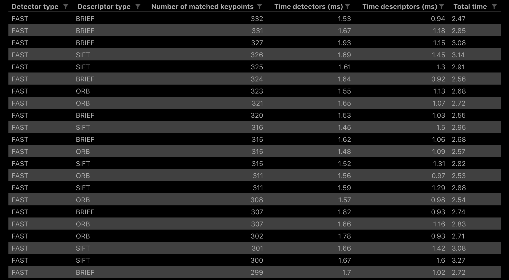
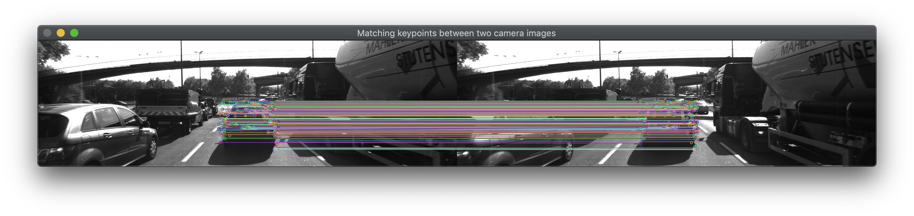

# SFND 2D Feature Tracking

This project is the second in a series for Udacity's Sensor Fusion Nanodegree. The project covers the following key concepts:

- Using ring buffers to avoid memory bloat while processing a sequence of images
- Keypoint detectors such as: Shi-Tomasi, Harris, FAST, BRISK, ORB, AKAZE, and SIFT
- Keypoint descriptor extraction and matching with: FLANN and k-NN

These techniques provide a foundation for the next step: time-to-collision estimation.

## Visualization of the results

**Keypoints visualized with SIFT detectors, indicating keypoint size and orientation**

**Performance benchmarks, sorted by number of matched keypoints**  


Matching algorithm is brute-force with filtering descriptor distance ratio set to `0.8`.

**Visualization of matched keypoints with FAST detectors and ORB descriptors**


## Overview of the workflow
1. Load the images into a ring buffer. 
1. Use OpenCV to apply a variety of keypoint detectors.
    - Shi-Tomasi
    - Harris
    - FAST
    - BRISK
    - ORB
    - AKAZE
    - SIFT (Patent encumbered, https://patents.google.com/patent/US6711293B1/en)
1. Use OpenCV to extract keypoint descriptors.
    - BRISK
    - BRIEF
    - ORB
    - FREAK
    - AKAZE
    - SIFT 
1. Use FLANN and kNN to improve on the brute force matching of keypoint descriptors.
1. Finally, run these algorithms in various combinations to compare performance benchmarks.

It's important to distinguish between the terms of art keypoint **detector** and keypoint **descriptor**. From Udacity's lecture notes:
> - A keypoint (sometimes also interest point or salient point) detector is an algorithm that chooses points from an image based on a local maximum of a function, such as the "cornerness" metric we saw with the Harris detector.
> - A descriptor is a vector of values, which describes the image patch around a keypoint. There are various techniques ranging from comparing raw pixel values to much more sophisticated approaches such as histograms of gradient orientations.

## Dependencies
* cmake >= 2.8
  * All OSes: [click here for installation instructions](https://cmake.org/install/)
* make >= 4.1 (Linux, Mac), 3.81 (Windows)
  * Linux: make is installed by default on most Linux distros
  * Mac: [install Xcode command line tools to get make](https://developer.apple.com/xcode/features/)
  * Windows: [Click here for installation instructions](http://gnuwin32.sourceforge.net/packages/make.htm)
* OpenCV >= 4.1
  * On macOS, simply `brew install opencv`
  * If compiled from source, ensure that cmake flag is set `-D OPENCV_ENABLE_NONFREE=ON` for testing the SIFT and SURF detectors.
  * The OpenCV 4.1.0 source code can be found [here](https://github.com/opencv/opencv/tree/4.1.0)
* gcc/g++ >= 5.4
  * Linux: gcc / g++ is installed by default on most Linux distros
  * Mac: same deal as make - [install Xcode command line tools](https://developer.apple.com/xcode/features/)
  * Windows: recommend using [MinGW](http://www.mingw.org/)

## Building and running the project
```
mkdir build && cd build
cmake ..
make
./2D_feature_tracking
```

## Writeup, Task MP.0

### MP.1 Data buffer optimization
The double ended queue `std::deque` offers constant time O(1) insertion and deletion of objects at each end of the queue. Checking the current size of the `deque` is similarly constant time. New items are added with `.push_back()` and, once the specified ring buffer size is reached, old items are dropped with `.pop_font()`.

### MP.2 Keypoint detection
_Lines 81-87 in MidTermProject_Camera_Student.cpp_
```
string detectorType = "...";  // Uncomment to set detector selection
```
### MP.3 Keypoint removal
_Lines 134-144 in MidTermProject_Camera_Student.cpp_
```
if (vehicleRect.contains(kp.pt))
    // Keep this keypoint, kp
```

### MP.4 Keypoint descriptors
_Lines 180-185 in MidTermProject_Camera_Student.cpp_
```
string descriptorType = "...";  // Uncomment to set descriptor selection
```

### MP.5 Descriptor matching
The function `matchDescriptors` in `matching2D_Student.cpp` contains a kind of decision tree structure, based on the settings of these string parameters:
- `descriptorCategory` either: `DES_BINARY` (binary), `DES_HOG` (histogram of gradients)
- `matcherType` either: `MAT_FLANN` (cv::FlannBasedMatcher), `MAT_BF` (brute force)
- `selectorType` either: `SEL_NN` (nearest neighbors), `SEL_KNN` (k nearest neighbors)

To reduce the complexity and chance of mismatching the descriptor category, I've made `descriptorCategory` conditional on the `descriptorType`. In this exercise, SIFT is the only histogram of gradients (HoG) based descriptor evaluated.

_Lines 205-214 in MidTermProject_Camera_Student.cpp_
```
/* For descriptor type, select binary (BINARY) or histogram of gradients (HOG) */
/* BINARY descriptors include: BRISK, BRIEF, ORB, FREAK, and (A)KAZE. */
/* HOG descriptors include: SIFT (and SURF and GLOH, all patented). */
string descriptorCategory {};
if (0 == descriptorType.compare("SIFT")) {
    descriptorCategory = "DES_HOG";
}
else {
    descriptorCategory = "DES_BINARY";
}
```
For the performance benchmarks (MP.7-9) below, `matcherType` was set to `MAT_BF` and `selectorType` was set to `SEL_KNN`, which implements match filtering based on the descriptor distance ratio.

### MP.6 Descriptor distance ratio
_Lines 75-82 in matching2D_Student.cpp_

I spent some time debugging here before realizing that the vector of vectors of `DMatch` objects, as returned by `cv::DescriptorMatcher::knnMatch`, may contain some nested vectors with size less than two.

This distance ratio filter compares the distance (SSD) between two candidate matched keypoint descriptors. A threshold of `0.8` is applied and the stronger candidate (minimum distance) is selected as the correct match. This method eliminates many false-positive keypoint matches.

### MP.7 Performance evaluation 1
The number of keypoints within the bounding box of the preceding vehicle were counted for each detector type.

See the results in: _Task_MP7.csv_

Harris had the fewest relevant keypoints, while the top three performers in this metric were:
1. FAST (consistently produced ~400 per image)
1. BRISK (254-297 keypoints per image)
1. AKAZE (155-179 keypoints per image)

### MP.8 Performance evaluation 2
The number of matched keypoints were then counted for each valid detector type and descriptor type combination, 35 in total. Note that SIFT descriptors could not be extracted with ORB detectors, and AKAZE descriptors worked only with AKAZE detectors.

See the results in: _Task_MP8_MP9.csv_

The FAST detectors with BRIEF, SIFT, and ORB descriptors consistently produced the largest number of matched keypoints (~300 per image).

### MP.9 Performance evaluation 3

With FAST detectors (broadly the fastest), the three fastest descriptors were:
1. BRISK
1. BRIEF
1. ORB

All of these combinations consistently ran in less than `3 ms` total time. See the results in: _Task_MP8_MP9.csv_

However, processing time must be balanced with the number of keypoints successfully matched in that time. For overall performance relevant to this project, the top three combinations were:

- FAST detectors and ORB descriptors
- FAST detectors and BRIEF descriptors
- FAST detectors and SIFT descriptors

There are two disadvantages to SIFT: patent royalties and the worst-case execution time. For the combination, some SIFT runtimes slipped to `6 ms` total time. The distribution of runtimes for FAST with ORB and BRIEF descriptors was more tightly bound within `3 ms`.
