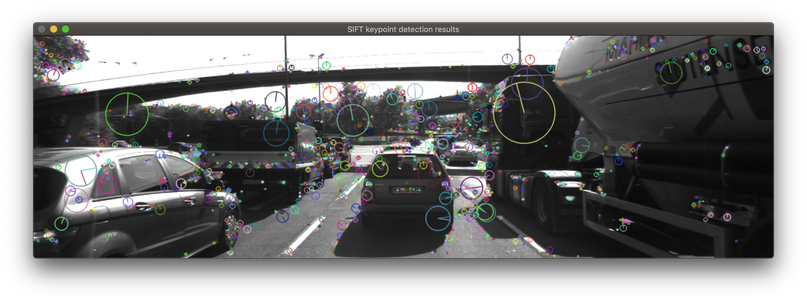

# SFND 2D Feature Tracking

This project is the second in a series for Udacity's Sensor Fusion Nanodegree. The project covers the following key concepts:

- Using ring buffers to avoid memory bloat while processing a sequence of images
- Keypoint detectors such as: Shi-Tomasi, Harris, FAST, BRISK, ORB, AKAZE, SIFT
- Keypoint descriptor extraction and matching with: FLANN, k-NN

This project provides the foundation for the following project: time-to-collision estimation.

## Visualization of the results


## Overview of the workflow
1. Load the images into a ring buffer. 
1. Use OpenCV to apply a variety of keypoint _detectors_.
  - Shi-Tomasi
  - Harris
  - FAST
  - BRISK
  - ORB
  - AKAZE
  - SIFT (Patent encumbered, https://patents.google.com/patent/US6711293B1/en)
<!-- 1. Use FLANN and kNN to improve on the brute force matching of keypoint _descriptors_. -->
<!-- 1. Finally, run these algorithms in various combinations to compare performance benchmarks.  -->

## Dependencies
* cmake >= 2.8
  * All OSes: [click here for installation instructions](https://cmake.org/install/)
* make >= 4.1 (Linux, Mac), 3.81 (Windows)
  * Linux: make is installed by default on most Linux distros
  * Mac: [install Xcode command line tools to get make](https://developer.apple.com/xcode/features/)
  * Windows: [Click here for installation instructions](http://gnuwin32.sourceforge.net/packages/make.htm)
* OpenCV >= 4.1
  * On macOS, simply `brew install opencv`
  * If compiled from source, ensure that cmake flag is set `-D OPENCV_ENABLE_NONFREE=ON` for testing the SIFT and SURF detectors.
  * The OpenCV 4.1.0 source code can be found [here](https://github.com/opencv/opencv/tree/4.1.0)
* gcc/g++ >= 5.4
  * Linux: gcc / g++ is installed by default on most Linux distros
  * Mac: same deal as make - [install Xcode command line tools](https://developer.apple.com/xcode/features/)
  * Windows: recommend using [MinGW](http://www.mingw.org/)

## Building and running the project
```
mkdir build && cd build
cmake ..
make
./2D_feature_tracking
```

## Comments
